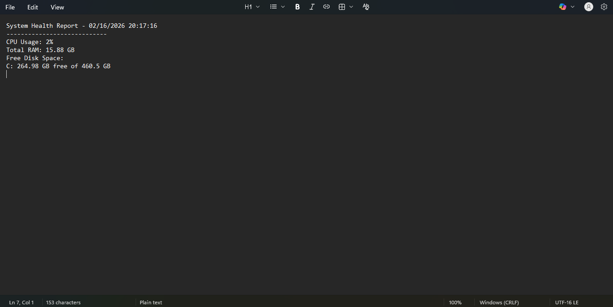

# System Health Check Report (PowerShell)

## Overview
This project is a PowerShell automation script that generates a real-time system health report for Windows machines.

The script collects:
- CPU usage (%)
- Total RAM (GB)
- Free and total disk space (GB)

The report is automatically saved as a .txt file in the user's Documents folder.

## Project Goal
To simulate a real-world IT Support / Helpdesk monitoring task by automating system diagnostics using PowerShell.

## Technologies Used
- Windows OS
- PowerShell
- WMI (Windows Management Instrumentation)

## How to Run
1. Download or clone this repository.
2. Open PowerShell as Administrator.
3. Navigate to the folder containing the script:
   cd path\to\folder
4. Run the script:
   .\SystemHealthReport.ps1
5. The report will be saved in:
   C:\Users\YourUsername\Documents\SystemHealthReport.txt

## Sample Output
System Health Report - 02/16/2026
----------------------------
CPU Usage: 2%
Total RAM: 15.88 GB
Free Disk Space:
C: 264.98 GB free of 460.5 GB

## Real-World Application
This script can be used for:
- Basic system health monitoring
- IT troubleshooting
- Remote diagnostics
- Proactive maintenance checks

## Author
Umer Tanvier

## Sample Output Screenshot

